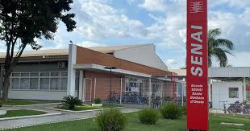

# Aula-2702-2: Manual do Aluno 
A Escola Senai de Alvares Romi iniciou as atividades em
25 de fevereiro de 1958 como Unidade de Formação
Profissional junto as instalações das Indústrias Romi
S.A. A escola Senai disponibiliza diversas áreas escolares como a Biblioteca, Cantina, Secretaria, AAPM (Associação de Alunos, Pais e
Mestres), Área de estágios, Área de qualidade de vida, CIPA (Comissão Interna de Prevenção
de Acidentes), entre outras atividades. Os principais principios da escola são o respeito às diferenças, pluralismo de ideias e garantia
de padrão de qualidade são alguns dos princípios que
norteiam a atuação do SENAI-SP. As escolas SENAI-SP seguem procedimentos de saúde
e segurança específicos para cada ambiente, incluindo
o uso de roupas adequadas, equipamentos de
segurança e acessórios conforme a atividade e as
normas regulamentadoras de cada área.

